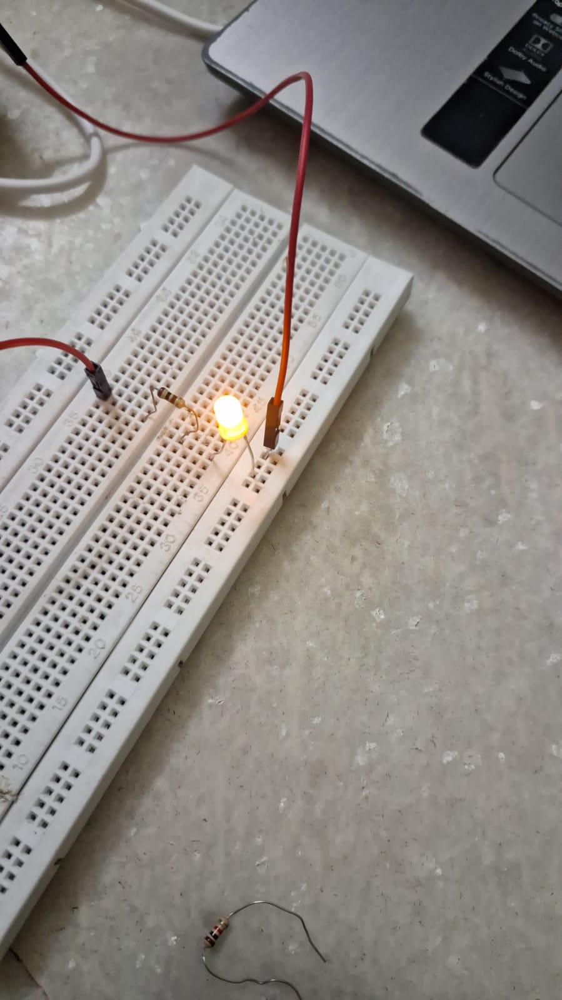
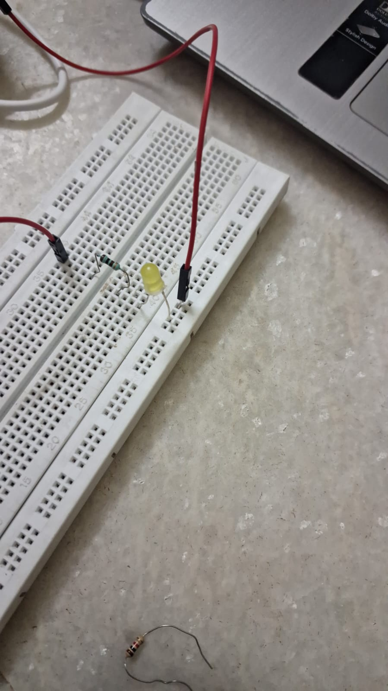
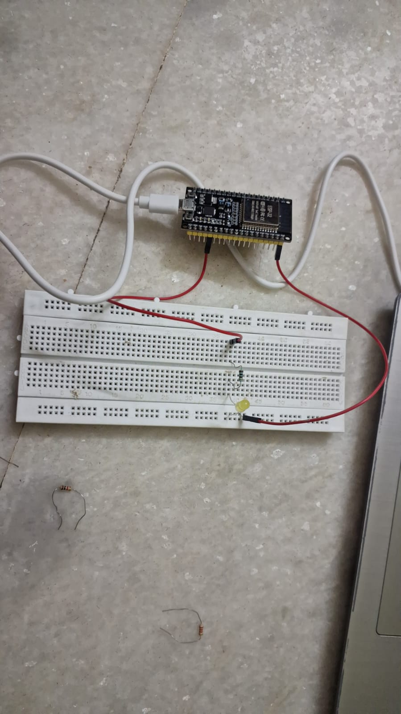

# ESP32-Web-Dashboard-Projects

This repository contains IoT projects built using ESP32 and a web-based dashboard.

## Project 1: LED Control using ESP32

### Overview
Control an LED from any device connected to the same Wi-Fi network using a web browser.

### Components Required
- ESP32 Development Board
- LED
- 220Ω Resistor
- Breadboard
- Jumper Wires

### Connections

| ESP32 Pin | Component |
|-----------|------------|
| GPIO 2 | LED (+) through 220Ω resistor |
| GND | LED (-) |

### Features
- Web-based dashboard
- LED ON/OFF control
- ESP32 acts as a web server

### Files
- Led_Control.ino

## Project Demonstration

### Dashboard

### LED ON State

### LED OFF State

### Circuit Diagram

## Future Projects
- DC Fan Control using L298N
- Home Automation Dashboard
- MQTT Device Control

## Author
**Pratham Shah**
